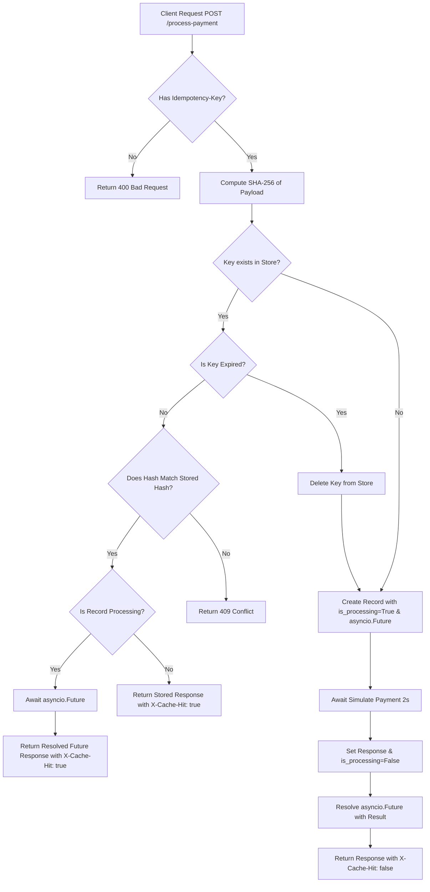
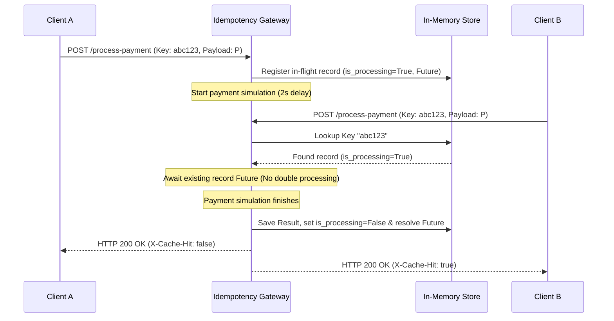

# Idempotency Gateway (The "Pay-Once" Protocol)

This service provides an **Idempotency Layer** for financial transactions at FinSafe Transactions Ltd. It acts as a middleware API that guarantees no matter how many times a client retries or resends a payment request, the actual charge is processed **exactly once**, preventing critical double-charging issues while handling concurrent race conditions safely.

---

## 1. Architecture Flow and Sequence Diagrams

### System Logic Flowchart

This flowchart outlines the lookup, hash validation, and concurrency checks executed for each incoming request:



### Concurrent Request Sequence Diagram

When two identical requests (A and B) arrive at the exact same time, Request B is blocked and waits for Request A to complete instead of executing a duplicate payment or returning an error:



---

## 2. Tech Stack

- **Language:** Python 3.11+ (specifically tested on Python 3.12)
- **Framework:** FastAPI (asynchronous, high performance)
- **Server:** Uvicorn
- **Validation:** Pydantic (data parsing and constraints)
- **Storage:** Thread-safe, coroutine-safe in-memory storage (`dict`)
- **Tests:** Pytest, HTTPX (async client), and AnyIO

---

## 3. Setup and Running Instructions

### Local Setup

1. **Navigate to the directory:**
   ```bash
   cd backend/Idempotency-gateway
   ```

2. **Create a virtual environment:**
   ```bash
   python -m venv venv
   ```

3. **Activate the virtual environment:**
   - **Windows (PowerShell):**
     ```powershell
     .\venv\Scripts\Activate.ps1
     ```
   - **Windows (CMD):**
     ```cmd
     .\venv\Scripts\activate.bat
     ```
   - **macOS / Linux:**
     ```bash
     source venv/bin/activate
     ```

4. **Install the dependencies:**
   ```bash
   pip install -r requirements.txt
   ```

### Running the API Server

Start the FastAPI application with Uvicorn:

```bash
uvicorn app.main:app --reload
```

The server will start at `http://127.0.0.1:8000`. You can access the interactive API docs at `http://127.0.0.1:8000/docs`.

---

## 4. API Documentation

### Process Payment

Processes a new payment transaction or replays a cached transaction safely.

* **URL:** `/process-payment`
* **Method:** `POST`
* **Headers:**
  - `Idempotency-Key` (Required, string): A unique key representing the transaction attempt.
  - `Content-Type`: `application/json`
* **Request Body:**
  ```json
  {
    "amount": 100,
    "currency": "GHS"
  }
  ```

#### Example Response - First Attempt (Success)
* **Status Code:** `200 OK`
* **Headers:**
  - `X-Cache-Hit`: `false`
* **Body:**
  ```json
  {
    "message": "Charged 100 GHS"
  }
  ```

#### Example Response - Duplicate Attempt (Cached Replay)
* **Status Code:** `200 OK`
* **Headers:**
  - `X-Cache-Hit`: `true`
* **Body:**
  ```json
  {
    "message": "Charged 100 GHS"
  }
  ```

#### Example Response - Fraud / Data Mismatch
* **Status Code:** `409 Conflict`
* **Body:**
  ```json
  {
    "detail": "Idempotency key already used for a different request body."
  }
  ```

#### Example Response - Missing Header
* **Status Code:** `400 Bad Request`
* **Body:**
  ```json
  {
    "detail": "Idempotency-Key header is required"
  }
  ```

---

## 5. Design Decisions and Key Mechanics

### 1. Concurrency Handling (`asyncio.Future`)
The core challenge in idempotency is blocking subsequent requests that arrive *while* the first is still processing. 
* When a request starts, it inserts an `IdempotencyRecord` containing a pending `asyncio.Future`.
* If a concurrent request arrives with the same key, it detects the in-flight status (`is_processing=True`) and simply executes `await record.future`.
* When the primary request finishes, it calls `future.set_result((status_code, body))` which instantly resolves the waiting request, returning the same response without running any payment logic a second time.
* If the primary request fails with an exception, the exception is set on the future to unblock waiters, and the record is deleted so clients can safely retry.

### 2. Request Fingerprinting (SHA-256)
To verify request body integrity and prevent fraud (e.g., reusing an idempotency key to send a different amount), we compute a SHA-256 hash of the request payload.
* The Pydantic model is serialized to a compact JSON string with sorted keys (`sort_keys=True`) and no whitespace (`separators=(',', ':')`).
* This normalized string is hashed. The resulting SHA-256 hex digest acts as a fingerprint, which is saved alongside the key.
* Reusing the same key with a different body will mismatch the stored hash, returning an `HTTP 409 Conflict`.

### 3. Developer's Choice Feature: Time-To-Live (TTL) Expiration
We implemented a Time-To-Live (TTL) mechanism for the cached idempotency records.
* **Why TTL is important:** In real payment systems, saving idempotency keys forever is impractical and dangerous. It causes unbounded memory growth and blocks clients from reusing valid transactional references years down the line. A standard TTL (like 24 hours) clears cache space and recycles key metadata while still protecting against network retries (which occur within seconds or minutes).
* **Implementation:** The record stores a `created_at` timestamp.
  - When the storage looks up a record, it lazily evaluates whether the elapsed time exceeds the `default_ttl_seconds` (e.g., 60 seconds).
  - If expired, the record is deleted and processed as a fresh request.
  - The TTL starts ticking from the *completion* of the payment request (rather than starting at creation), preventing keys from expiring prematurely during heavy API latency.

---

## 6. Testing Instructions

Run the pytest suite to verify all requirements are working:

```bash
pytest tests/
```

### Covered Test Cases
1. **First Payment Success:** Validates payload, 2-second processing delay, correct response body, and `X-Cache-Hit: false`.
2. **Duplicate Request Replay:** Validates that subsequent duplicate requests return immediately (<0.1s), with matching body and `X-Cache-Hit: true`.
3. **Mismatched Payload Conflict:** Validates that reusing the same key with a modified body returns `409 Conflict`.
4. **Missing Header:** Validates that calls without `Idempotency-Key` are rejected with `400 Bad Request`.
5. **Concurrent Blocking:** Simulates two requests arriving at the same time using `asyncio.gather`. Verifies they take a total of 2 seconds (not 4), process once, and return identical results with correct headers.
6. **TTL Expiration:** Configures TTL to 0.5s, sleeps 0.6s, and verifies that the key is cleared and successfully processed again.
